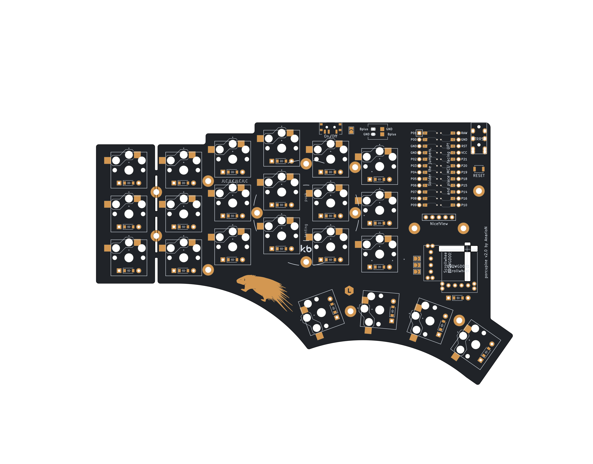
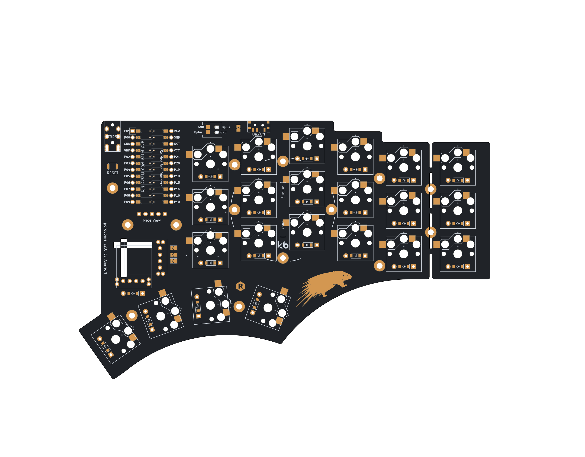

# Porcupine 

Porcupine is an autogenerated, ergonomic, split, 36-42 key, wired/wireless, columnar-staggered keyboard. It is designed to fit my needs and my hand, but it can be easily updated thanks to declarative design.
It uses a ProMicro-comaptible MCU board and supports both [QMK](https://qmk.fm/) and [ZMK](https://zmk.dev/) firmwares.

It is inspired by:
* [[Ferris] Sweep](https://github.com/davidphilipbarr/Sweep) keyboard
* [rae-dux](https://github.com/andrewjrae/rae-dux) keyboard
* [samoklava](https://github.com/soundmonster/samoklava) and its workflow
* all the work done by [Ben Vallack](https://github.com/benvallack) on his [Youtube channel](https://www.youtube.com/c/BenVallack)

It is fully Open-Source: the KiCad files are released under the solderpad license, version 2.1. The software (scripts/config files) in this repository is released under the GPL.

## Features :sparkles:
* Autogenerated - PCB layout is declared using YAML config files and generated into PCB files using [Ergogen](https://github.com/ergogen/ergogen) tool (migrated to V4).
Use [my fork](https://github.com/anarion80/ergogen) of it for added footprints.
* 3 variants:
  - regular 5x3 column-staggered ortholiner layout with 3 thumb keys (36 keys total)
  - regular 5x3 column-staggered ortholiner layout with 4 thumb keys (38 keys total)
  - regular 6x3 column-staggered ortholiner layout with 4 thumb keys (42 keys total)
* Wired or wireless
* Low-profile (using [Kailh Choc](http://www.kailh.com/en/Products/Ks/CS/) switches)
* Reversible PCB (save cost in production)
* Pro-micro/Elite C/Proton C/[nice!nano](https://nicekeyboards.com/nice-nano/) support
* Hot-Swap support
* SplitKB Tenting puck support.
* uses [KiKit](https://github.com/yaqwsx/KiKit) to render PCB previews (see below)
* uses [KiBot](https://github.com/INTI-CMNB/KiBot) to run DRC, create Gerber and Drill files for production (and Interactive BOM and 3d renders just for fun)

Front/Left | Back/Right
-|-
Porcupine
 | 
Porcupine 4 thumb keys
 | 
Porcupine 3x6
 | 

## :boom: This is currently in development phase so use at your own risk :exclamation:

## Components list :receipt:

To build and use a Porcupine you will need:

* 1x PCB Kit
* 2x promicro compatible boards or 2 nice!nanos.
* 34-42 Choc V1 Low profile switches
* 34-42 Kailh Choc hot-swap sockets
* 34-42 diodes (SMD or THT)
* 34-42 keycaps
* 2x reset switches (optional; B3U-1000P(M))
* Some little rubber feet/bumpers
* 2x power (On/Off) switches (optional; MSK 12C02)
* JST PH battery connector (optional; S2B-PH-K)
* Li-Po 110mAh battery (optional; 301230)
* 1x TRRS (not TRS!) cable (wired build only)
* 2x TRRS Jack [PJ-320A] (wired build only)
* 1 USB Cable (depends on your micro-controller choice)

## Build Guide :construction_worker:

Manually-routed PCBs for each variant are included in the `output` folder, so if they are fine for you, you can just take them directly, have them produced and then build. 

I don't have a dedicated build guide. Please refer to [@tzcl rae-dux build guide](https://www.tzcl.me/blog/rae-dux) or [Kyek's video](https://www.youtube.com/watch?v=fBPu7AyDtkM) -
they should give you enough of info to build Porcupine as well. Just remember that Porcupine is reversible, so you need to solder the jumpers under MCU board and then place them facing up on both sides :exclamation:

- If you're going for a wired version, the on/off switch is optional, but you need to solder the Jumper.
- If you're going for a wireless version, you can skip soldering TRRS jacks.

## Firmware/keymaps :keyboard:

QMK/ZMK keymaps will be here once the proptotype is built.

## How to use/update/modify :pencil2:

If you would like to modify this:
* fork it
* (optionally, to see the 3d view of generated PCB in KiCad)
  - copy 3d models from `3dmodels/ergogen` folder into your KiCad's installation `${KICAD6_3RD_PARTY}/3dmodels/ergogen/` folder[^1].
* change `input/porcupine*.yaml` to your liking
* commit to Github

The associated Github Workflow action will then generate the PCB, 2D Images of the board and a whole KiBot package with Gerber/Drill files, Interactive Bom, images and renders.
The files will be available as Workflow Action artifacts.

:warning: The boards will come out unrouted! But if you add a manually routed board to `output/[board_name]/pcbs/` folder, the Workflow will pick it up and generate everything for it as well.

If you would rather do all that locally, then:

* install Ergogen: `npm install`
* install Docker
* generate PCBs: `npm run gen_pcb`
* generate images: `npm run gen_images`
* generate Kibot package: `npm run gen_kibot`

Further:

* route the board manually in KiCad
* produce (for eample in [JLCPCB](https://jlcpcb.com/) or [PCBWay](https://www.pcbway.com/))
* build
* load firmware
* use it!

## Important Notes :warning:
- Kicad files are 6.0, so unfortunately not backwards compatible.
- If you're going for wired version or just want to skip out on the power switch, you need to solder the Jumper.
- Manually-routed boards are included, but there is no autorouting for generated boards.
- You need to have Docker installed to use `npm run gen_images` or `npm run gen_kibot` to generate pcb images and Kibot bundle.

## TODO :hammer:
- [ ] a variant with MX switches
- [x] automation of DRC/BOM/Gerber creation/validation with Github workflow
- [ ] proper 3d-printable cases
- [ ] LED support

## Disclaimer :page_facing_up:

The author(s) waive(s) responsibility for any damage or regulatory violations caused by using this hardware and software (see license). Please consult your local regulations around radio frequencies and what's allowed for DIY projects in your country.

Porcupine logo by [@migorzka](https://www.instagram.com/migorzka/)

[^1]: The models are bundled here in the repository, but they are taken from [KiCad](https://www.kicad.org/) directly, from [keyswitch-kicad-library](https://github.com/perigoso/keyswitch-kicad-library) or are created by me.