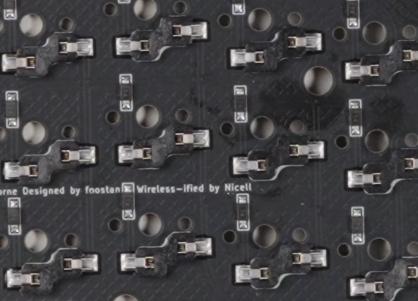

# Porcupine keyboard build guide

This build guide assumes a basic understanding of soldering, if this is your
first time soldering, first watch a tutorial on the basics of soldering. I
recommend [the tutorial by greatscott](https://youtu.be/VxMV6wGS3NY).

## Parts

* 1x PCB Kit
* 2x promicro compatible boards or 2 nice!nanos.
* 34-42 Choc V1 Low profile switches
* 34-42 Kailh Choc hot-swap sockets
* 34-42 diodes (SMD or THT) 
* 34-42 keycaps
* 2x reset switches (optional; B3U-1000P(M))
* 4x 12x low profile female headers (optional; only if you want the microcontroller socketed)
* 48x Mill Max low profile socket pins (optional; socketed microcontroller; if you are using tht diodes you can use the legs of those diodes)
* Some little rubber feet/bumpers
* 2x power (On/Off) switches (optional; MSK 12C02)
* JST PH battery connector (wireless build; S2B-PH-K)
* Li-Po 110mAh battery (wireless build; 301230)
* 1x TRRS (not TRS!) cable (wired build only)
* 2x TRRS Jack [PJ-320A] (wired build only)
* 1 USB Cable (wired build; depends on your micro-controller choice)

## Getting the pcb printed

There are a few services where you can print pcb, I used JLCPCB but others will
work too.

First grab the kicad file for the version you want to build located in 
`output/[version]/pcbs/[version]_routed.kicad_pcb`

Then export the gerber files using 
[this guide](https://jlcpcb.com/help/article/362-how-to-generate-gerber-and-drill-files-in-kicad-7).

When ordering the from JLCPCB the defaults are fine, the only thing I changed 
was the color to black.

The pcb design is reversible, so both sides of the keyboard use the
same pcb. So no need to order two separate pcb's.

## Build Guide

The build process is straight forward. Just make sure to double check everything
before soldering. Getting this wrong will mean desoldering which is a pain and
can result in lifted pads if you aren’t careful. Better to get it right and not
have to deal with that.

The pcb is reversible, so keep in mind that everything you solder on one side
should be on the other side on the other pcb.

Note: some of the pictures were taken from build guides from different
keyboards so don't be confused if things look a bit different.

1. Solder the hotswap sockets to the back of the pcbs.

The sockets should be soldered on the back side of the pcb. Simply lay the pcb
down an solder the hotswap socket lying down like this:



2. Solder the diodes on the same side as the hotswap sockets

I used 1n4148 SOD123 smd diodes, through hole diodes should also work fine. I
recommend the smd variant because of the lower profile. The easiest way to
solder a smd diode is to first put a little bit of solder on the on
pad, than heat up that pat and push the diode into the pad. First take away the
soldering iron, then the tweezer. A demonstration of this technique can be
viewed [in this youtube video](https://youtu.be/vzDTdLaAzXc?si=NDmReE-nNHSbSBwx&t=499).

For the through hole variant make sure to cut off the legs close to the board
otherwise there might not be enough space for the switches.

Make sure the line on the diode matches the line on the pcb.

3. (Optional) Solder the reset button to the pcb.

A similar technique to the diodes can be used.

4. (Wireless build) Solder on the jst power connector. 

A useful tip for these and for the JST connectors is to use some masking tape
to hold them in place while you’re soldering. With the JST connectors, it’s
important to place them in the right through-holes. Make sure that the red cord
goes to Bplus and the black cord to GND. 

5. Solder on the power switches, or solder the jumper.

If you are not using the on/off switch solder, the jumper next to the switch.

The sliding switches have 7 small pads so they are a little more difficult to
solder than the hotswap sockets. Take your time and reduce the heat of your
soldering iron. It has two pins that fit into holes in the PCBs which should
help keep them in place.

6. (Wired build) Solder the trrs jack

Use tape to hold the component in place.

7. Solder the jumpers

Because the pcb is reversible we need to solder jumpers. Solder on the side
with the switches and microcontroller, so the opposite side of the hot swap
sockets and diodes.

8. Break the female machined pin headers into four rows of 12
9. Solder the pin headers to the front of each PCB
10. Insert the mill-max pins into the pin headers
11. Put the microcontrollers in position and solder them to the mill-max pins
(they should be facing up)

The last step is socketing the microcontrollers. If you’ve never done this
before, the splitkb.com docs have a good guide with pictures. Break off four
rows of 12 of the female machined pin headers and solder them to the front of
each PCB. Again, masking tape may come in handy. Once that’s done, insert the
mill-max pins into the sockets and then put the microcontrollers into place.
Make sure the left microcontroller should be flipped so the flat side (the
back) is facing upwards. Then, solder the pins to the controllers. Be careful,
take your time and reduce the heat of your soldering iron.

Make sure it is the pins all line up correctly, by checking if all the GND pins
match the labels on the pcb.

12. (Wireless build) Lift the microcontrollers from the sockets, position the batteries between the pin headers and reseat the microcontrollers on top of the batteries
13. Insert the switches into the sockets, making sure not to bend any pins.
14. Push the keycaps into the switches.

## Compiling and flashing using qmk

First install and setup qmk using this [guide](https://docs.qmk.fm/newbs_getting_started).

Then navigate to the keyboards directory:

```
cd qmk_firmware/keyboards/
```

Then clone and rename the qmk repo:

```
git clone https://github.com/anarion80/porcupine_qmk
mv porcupine_qmk porcupine
```

Then you can compile a chosen keymap. While compiling you will see some errors
related to the layout, these can be ignored.

```
qmk compile -kb porcupine -km default
qmk compile -kb porcupine -km default_5x3_4
qmk compile -kb porcupine -km default_6x3_4
```

By default it compiles for the elite c, if you are using another board it can
be converted using the convert to flag. In this case it is compiled for a
microcontroller using the rp2040 chip. For more info on converting read the 
[documentation](https://docs.qmk.fm/feature_converters).

```
qmk compile -kb porcupine -km default -e CONVERT_TO=rp2040_ce
```

Flashing depends on what microcontroller was used, read the [documentation](https://docs.qmk.fm/flashing).

## Acknowledgement
This build guide was adapted from the [rae-dux build guide](https://www.tzcl.me/posts/rae-dux/).
